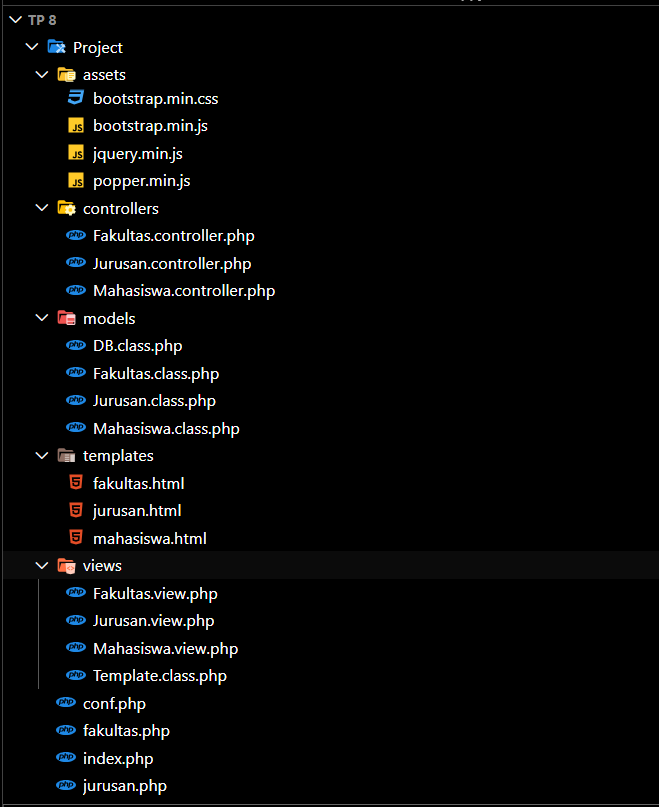

# TP8DPBO2025C2

Saya Rexy Putra Nur Laksana dengan NIM 2309578 mengerjakan Tugas Praktikum 8 dalam mata kuliah Desain dan Pemrograman Berorientasi Objek untuk keberkahanNya maka saya tidak melakukan kecurangan seperti yang telah dispesifikasikan. Aamiin.

## Desain Program

Program ini menggunakan pola MVC (Model-View-Controller) sederhana. Data dari database diakses melalui class Model, kemudian ditampilkan ke pengguna melalui class View, dan alur interaksi pengguna dikendalikan oleh file utama seperti jurusan.php sebagai Controller. Data jurusan dan fakultas saling terhubung melalui relasi ID, dan ditampilkan dalam bentuk tabel dan form dinamis.

## Desain Database

### Database `db_tp8`

#### Tabel `Fakultas`
| Kolom          | Tipe                      | Deskripsi                               |
| -------------- | ------------------------- | --------------------------------------- |
| id             | INT (AUTO\_INCREMENT, PK) | Identifikasi unik untuk setiap fakultas |
| nama\_fakultas | VARCHAR(100)              | Nama lengkap fakultas                   |

#### Tabel `Mahasiswa`
| Kolom         | Tipe                      | Deskripsi                                       |
| ------------- | ------------------------- | ----------------------------------------------- |
| id            | INT (AUTO\_INCREMENT, PK) | Identifikasi unik untuk setiap jurusan          |
| nama\_jurusan | VARCHAR(100)              | Nama lengkap jurusan                            |
| id\_fakultas  | INT (FK ke `fakultas.id`) | Menunjukkan jurusan ini berada di fakultas mana |

#### Tabel `Jurusan`
| Kolom           | Tipe                     | Deskripsi                                         |
| --------------- | ------------------------ | ------------------------------------------------- |
| nim             | VARCHAR(20), PK          | Nomor Induk Mahasiswa (unik untuk tiap mahasiswa) |
| nama\_mahasiswa | VARCHAR(100)             | Nama lengkap mahasiswa                            |
| telepon         | VARCHAR(15)              | Nomor telepon mahasiswa (opsional)                |
| tanggal\_masuk  | DATE                     | Tanggal mahasiswa mulai terdaftar                 |
| id\_jurusan     | INT (FK ke `jurusan.id`) | ID jurusan tempat mahasiswa terdaftar             |

## Struktur File

## Alur Program
1. Halaman utama menampilkan daftar mahasiswa dari database dalam bentuk tabel.
2. Data ditampilkan melalui class View yang menerima input dari Controller.
3. Saat pengguna menambahkan atau mengedit data, form akan mengirimkan data ke file PHP yang bertindak sebagai Controller.
4. Controller akan memproses input, lalu memanggil Model untuk menyimpan perubahan ke database.
5. Setelah operasi selesai (tambah/edit/hapus), pengguna akan diarahkan kembali ke halaman utama untuk melihat data terbaru.
6. Dropdown pada form jurusan dan mahasiswa akan menampilkan daftar fakultas atau jurusan yang diambil dari tabel relasi.

## Dokumentasi

### Mahasiswa / Home 

### Jurusan

### Fakultas

